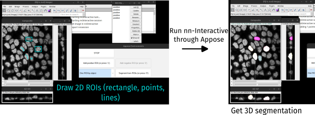
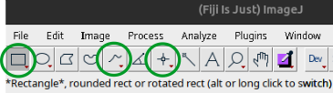

Plugin to use [nnInteractive](https://github.com/MIC-DKFZ/nnInteractive) in Fiji thanks to [Appose](https://apposed.org/).

nnInteractive allows for semi-automatic segmentation of 3D objects by placing manual prompts (seeds) in or around the object to be segmented.
Prompts can be positive to indicates the location (or contours) of the object, or negative to constraint the segmentation.

## Installation

You can install the plugin for the unliste update site `Appose-Playground`:
in Fiji, go to `Help>Update...` then to `Manage Update Sites` in the window that opens.
Click `Add unliste update site`, name it `Appose-Playground` and write its address `https://sites.imagej.net/Appose-Playground`.

Select the nnInter_Appose-* `.jar` file to install only this plugin, or keep all proposed plugins.
Press `Apply changes` and restart Fiji when it's done.

> [!NOTE]
> You should have a recent version of Fiji, based on Java 21 or more. [Download a more recent version](https://imagej.net/software/fiji/downloads) if you're current installation is too old.

## Usage

First open the image to annotate.

### Image dimensions
The image must be a 3D (Z slices or T frames) image.
It does not support 2D image or 3D+time stacks.
If the image as several channels, only the currently active one will be used.

### Initialization
Then go into `Plugins>Annotation>nnInteractive`.
Wait for the plugin to start: it will install if necessary a new python environment, then initialize nnInteractive on your image.

When it is ready, a new image `Composite` will apear, with your image as first chanel, and the resulting segmentations will be added to the second chanel.

### Annotate
You can either do multiple objects at the same time, by doing only one prompt (ROI) by object (choose option `One ROI by object`), or do only one at a time with as many prompts (ROIs) as you want for a finer segmentation (choose option `All ROIs for one object`).

Draw prompts and add them to the RoiManager. 

See [nnInteractive](https://github.com/MIC-DKFZ/nnInteractive) for what prompts are possible and their usage.
In this Fiji plugin, currently possible options to annotate are (other ROIs might be added later, you can also file an issue to ask for one to be added):
* Rectangle ROI -> nnInteractive bounding boxes
* Point ROI -> nnInteractive point seed
* Line ROI -> nnInteractive scribble. In the Fiji side, it can be any type of line ROI (single line, segmented line, or freehand line).

If you want the prompt to be a positive interaction (see nnInteractive documentation), press `1` to add the current ROI to the ROIManager as a positive one. 
For a negative prompt (relevant in `All ROIs for one object` mode), press `2` to add the current selection to the RoiManager as a negative one.

### Segment
When you have added all the prompts for this iteration, click the button `Segment from ROIs`, or press `0` and wait for the process to finish.

The new label(s) will be added in the second chanel of the Composite image.
